# 📐 Universal Template Builder - Diagramas UML

## Índice

1. [Diagrama de Clases](#diagrama-de-clases)
2. [Diagrama de Componentes](#diagrama-de-componentes)
3. [Diagrama de Secuencia](#diagrama-de-secuencia)
4. [Diagrama de Estados](#diagrama-de-estados)
5. [Diagrama de Despliegue](#diagrama-de-despliegue)
6. [Diagrama de Actividades](#diagrama-de-actividades)

---

## 🏛️ Diagrama de Clases

### Frontend - Core Classes

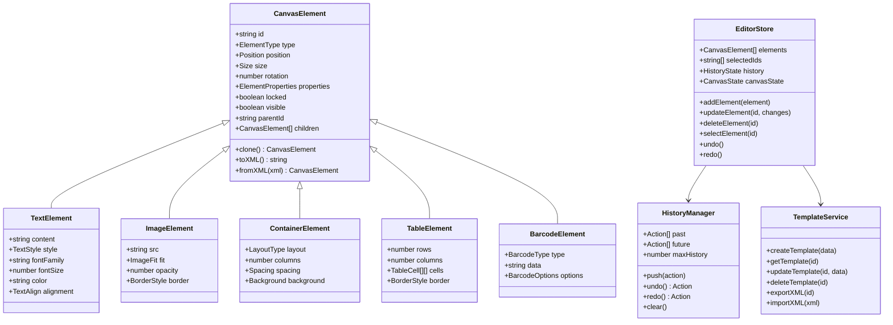

### Backend - Core Classes

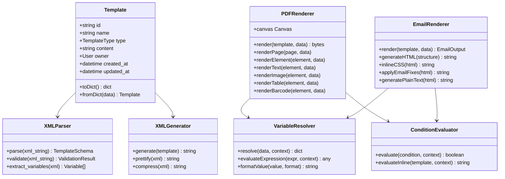

---

## 🧩 Diagrama de Componentes

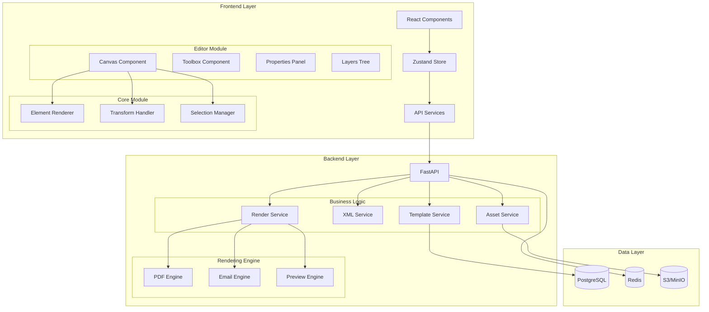

---

## 🔄 Diagrama de Secuencia

### Secuencia: Crear y Renderizar Plantilla PDF

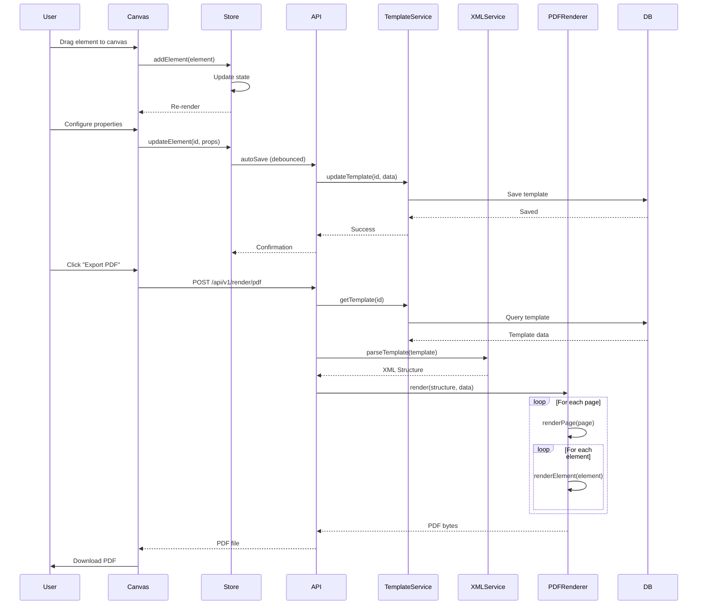

### Secuencia: Colaboración en Tiempo Real

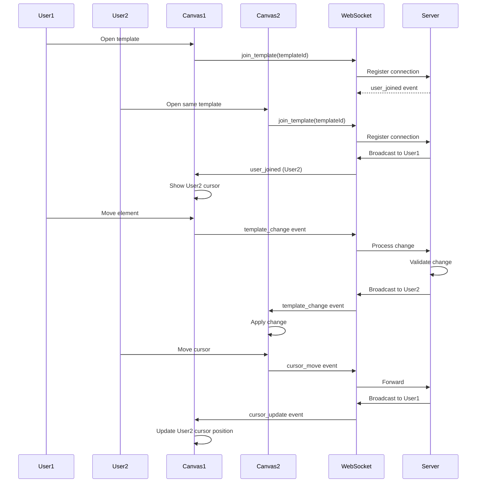

---

## 🔀 Diagrama de Estados

### Estados del Editor

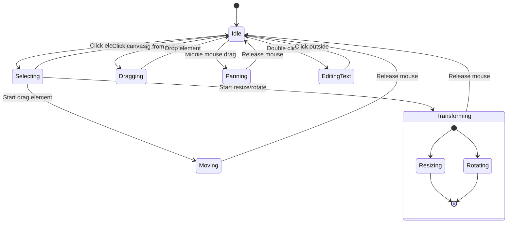

### Estados de una Plantilla

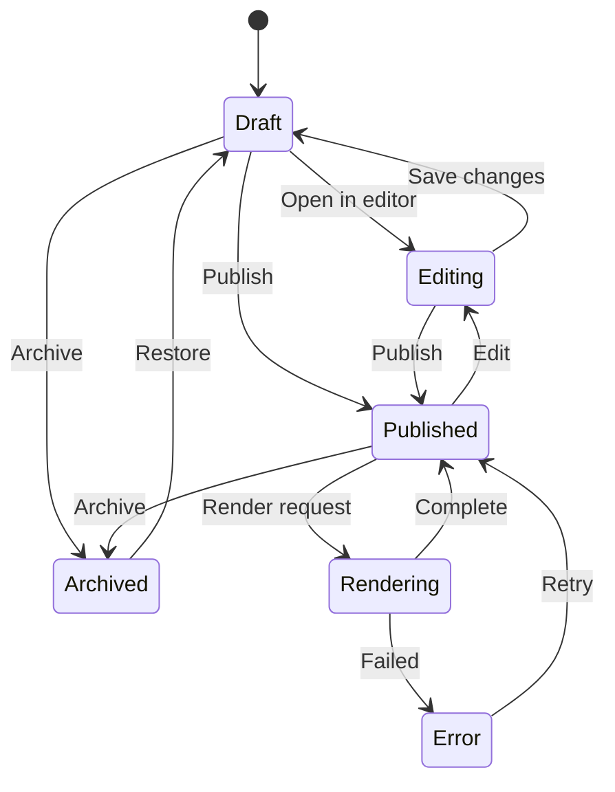

---

## 🚀 Diagrama de Despliegue

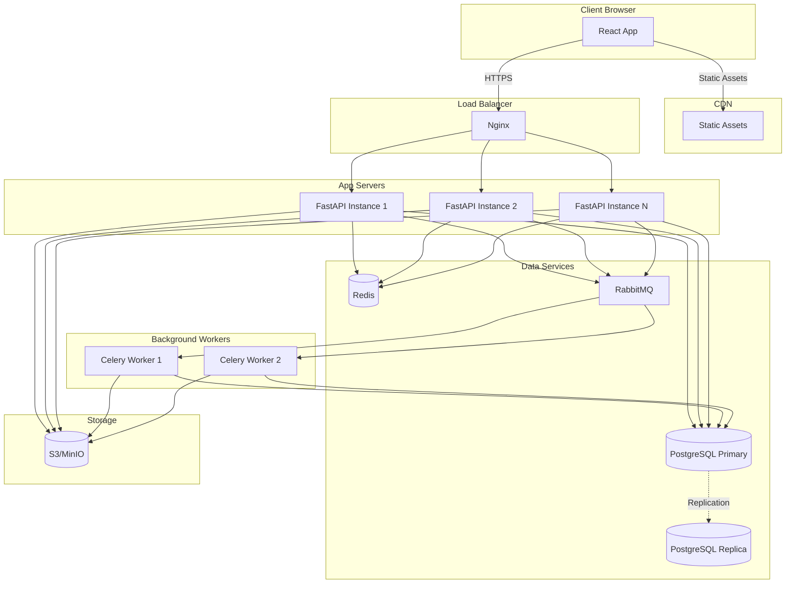

---

## 📊 Diagrama de Actividades

### Actividad: Exportar Plantilla como PDF

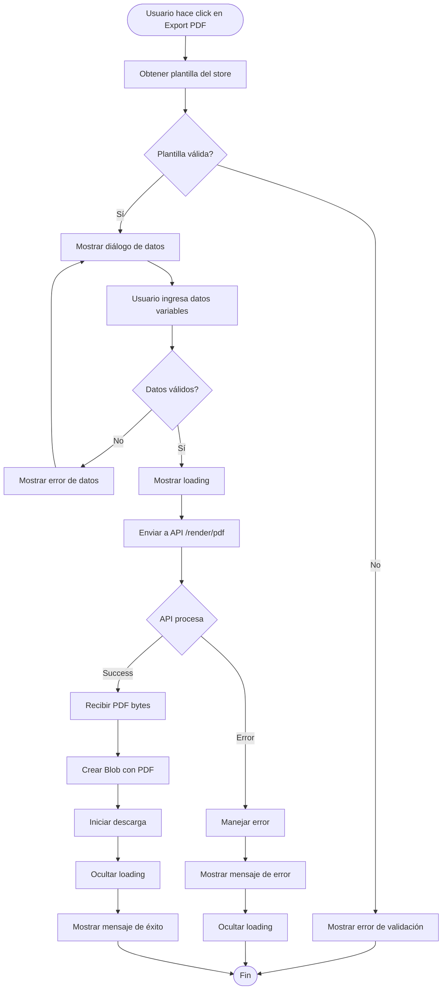

### Actividad: Procesar XML en Backend

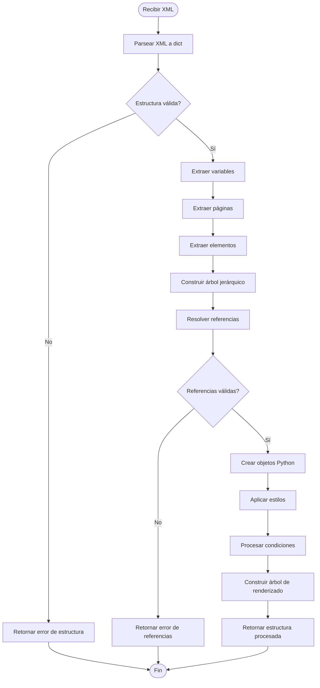

---

## 🎨 Diagrama de Arquitectura de Canvas

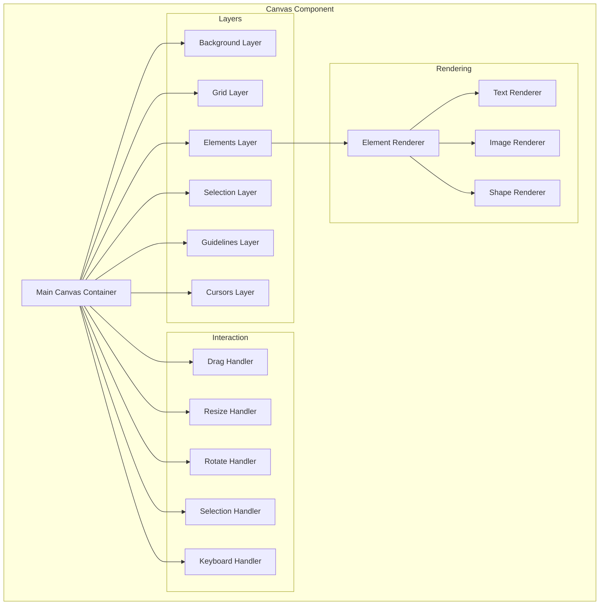

---

## 📦 Diagrama de Módulos

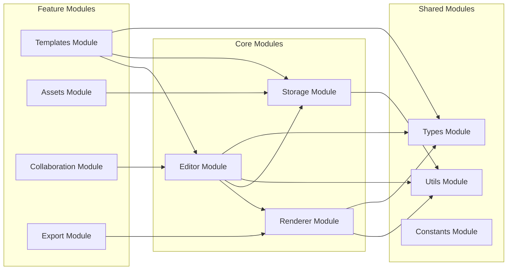

---

## 🔐 Diagrama de Seguridad

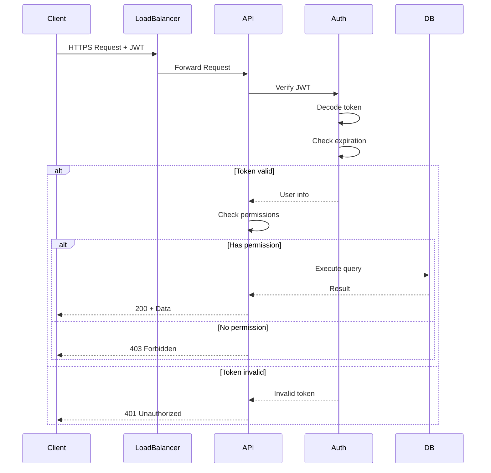

---

**Última actualización:** 2025-11-25
